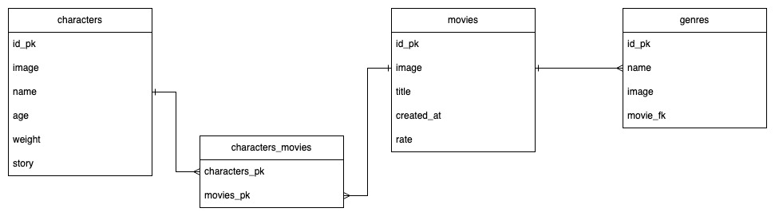
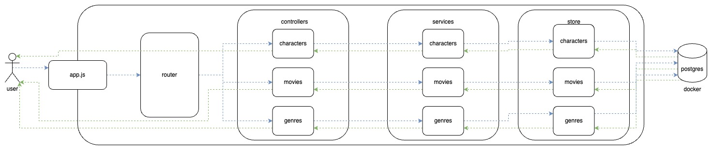

# Prueba técnica

## Diseño de la base de datos



## Arquitectura por capas


## Ejecución del proyecto
### 1. Instalar las dependencias
```
npm install
```

### 2. Ejecutar localmente
```
npm run start:local
```